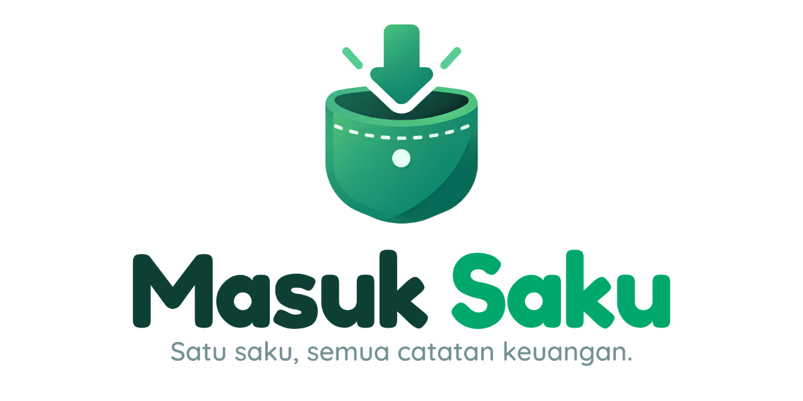
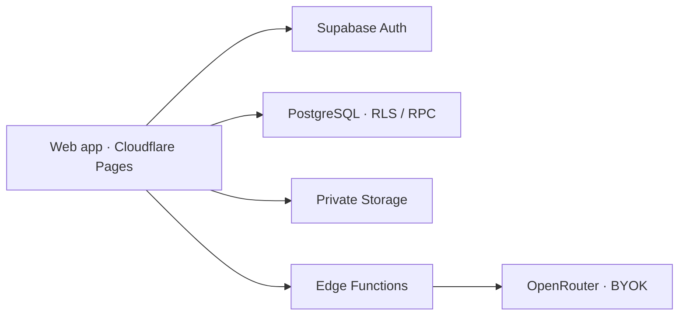

<div align="center">

# Masuk Saku

**Satu saku, semua catatan keuangan.**

[](https://github.com/huseinrosidstilllearn/masuk-saku/actions)
[](package.json)
[](LICENSE)
[](https://masuksaku.my.id)
[](docs/PRD.md)

[Buka aplikasi](https://masuksaku.my.id) · [Coba Development](https://masuk-saku-development.pages.dev) · [Panduan teknis](docs/DEPLOYMENT.md) · [Roadmap](docs/ROADMAP.md)

</div>

Uang keluarga sering tersebar di rekening bank, dompet digital, dan uang tunai. Masuk Saku membantu menyatukan catatannya, supaya kamu bisa melihat saldo, pengeluaran, anggaran, dan target tabungan tanpa berpindah-pindah spreadsheet.

Masuk Saku adalah **web app open source**. Gunakan langsung di browser atau jalankan dengan backend milikmu sendiri.

## Kenali Masuk Saku

### Catatan sehari-hari yang lebih teratur

Catat pemasukan, pengeluaran, dan transfer antar-dompet. Lengkapi dengan kategori, tag, biaya admin, atau pembagian transaksi. Pencarian, filter, dan riwayat perubahan membantu kamu menemukan kembali catatan yang dibutuhkan.

### Satu rumah, tetap punya ruang pribadi

Dashboard keluarga memberi gambaran bersama; dashboard personal mengikuti kepemilikan dompet. Kamu bisa menggunakan dompet pribadi dan dompet bersama, mengundang anggota keluarga, serta mengatur anggaran dan target tabungan.

Profil juga bisa disesuaikan dengan foto, nama panggilan, dan informasi pribadi. Hanya nama panggilan yang terlihat oleh keluarga; foto dan detail pribadi tetap untuk pemilik akun.

### AI membantu, kamu yang memutuskan

Upload atau foto struk untuk membuat draft transaksi. Periksa nominal, tanggal, dompet, dan kategorinya, lalu konfirmasi ketika sudah benar. **AI tidak menyimpan transaksi tanpa persetujuanmu.**

AI memakai OpenRouter dengan API key milikmu sendiri dan hanya model gratis. Pencatatan manual tetap tersedia tanpa AI.

### Rencana yang mengikuti keseharian

Atur transaksi mingguan/bulanan dengan tinjauan setiap kejadian atau aturan otomatis yang kamu setujui. Anggaran bisa dimulai kembali setiap periode atau membawa sisa positif. Target tabungan membantu merencanakan kontribusi tanpa mengubah saldo dompet.

Susun dashboard, buka pencarian cepat dengan **Ctrl+K**, dan bandingkan laporan antarperiode. Ekspor JSON/CSV tersedia; Owner dapat meninjau dan mengimpor data ke keluarga sendiri. Baca [panduan Fitur V1](docs/V1-FEATURES.md) untuk seluruh alurnya.

## Mulai menggunakan

Buka [masuksaku.my.id](https://masuksaku.my.id), lalu daftar atau masuk dengan email/username dan password. Provider Google juga sudah diaktifkan di Production dan Development.

Setelah masuk, buat keluarga dan dompet, kemudian mulai mencatat transaksi. Untuk AI, buka **Profil → Pengaturan AI & API key**. Endpoint OpenRouter sudah diatur otomatis; cukup masukkan API key milikmu.

Aplikasi berjalan di browser dan menyesuaikan layar desktop, tablet, maupun ponsel. Saat ini belum ada aplikasi native atau pencatatan offline.

## Coba di komputer sendiri

Siapkan Node.js **22.12 atau lebih baru**, npm, dan browser modern.

```sh
git clone https://github.com/huseinrosidstilllearn/masuk-saku.git
cd masuk-saku
npm ci
npm run dev:demo
```

Buka `http://127.0.0.1:5173`. Mode demo memakai contoh generik dalam memori. Kamu bebas mencoba; refresh mengembalikan data awal dan perubahan tidak masuk ke database.

### Hubungkan backend milikmu

Salin `.env.example` menjadi `.env.development.local`, lalu isi URL dan publishable key project Supabase milikmu:

```dotenv
VITE_SUPABASE_URL=https://YOUR_PROJECT.supabase.co
VITE_SUPABASE_ANON_KEY=YOUR_PUBLIC_PUBLISHABLE_KEY
```

Jalankan `npm run dev` untuk membuka aplikasi yang terhubung ke backend tersebut. Schema dan fungsi server perlu dipasang terlebih dahulu; langkah lengkapnya ada di [panduan deployment](docs/DEPLOYMENT.md).

Untuk Production, gunakan project dan `.env.production.local` yang terpisah. Jangan menaruh service-role key, password database, atau API key AI di variabel `VITE_*`. Script dengan project ref resmi repository perlu disesuaikan sebelum dipakai untuk deployment sendiri.

## Cara kerjanya

Frontend dibuat dengan **React, TypeScript, dan Vite**, lalu disajikan melalui **Cloudflare Pages**. **Supabase** menangani autentikasi, database PostgreSQL, file privat, dan fungsi server. AI terhubung melalui **OpenRouter**.



Fungsi AI menghasilkan draft untuk ditinjau di aplikasi. Transaksi baru ditulis melalui RPC setelah konfirmasi pengguna. Pemilik dompet, pelaku transaksi, cakupan personal/keluarga, dan pembuat catatan memiliki identitas yang terpisah.

Nominal V1 menggunakan **IDR dalam integer rupiah**. Waktu transaksi memakai **WIB dan format 24 jam**. Kunci AI dienkripsi di server; file struk dan foto profil berada di Storage privat.

Baca [arsitektur](docs/ARCHITECTURE.md) dan [spesifikasi teknis](docs/TECHNICAL-SPEC.md) untuk detail implementasi.

## Pengembangan dan pemeriksaan

| Perintah                    | Kegunaan                          |
| --------------------------- | --------------------------------- |
| `npm run dev:demo`          | Mencoba aplikasi tanpa backend    |
| `npm run dev`               | Menggunakan backend Development   |
| `npm run build`             | Membuat Production build di dist/ |
| `npm run build:development` | Membuat Development build         |
| `npm run build:demo`        | Membuat build demo                |
| `npm run preview`           | Melihat hasil build secara lokal  |

Sebelum mengirim perubahan, jalankan pemeriksaan berikut:

```sh
npm run check
npm run test:e2e -- --workers=2
npm run test:auth -- --workers=2
npm run format:check
```

Tes browser memerlukan Chromium; pasang dengan `npx playwright install chromium` bila diperlukan. Tes SQL menggunakan PGlite, sedangkan tes autentikasi memakai backend fixture. Keduanya tidak membutuhkan akun Production.

Untuk perubahan fungsi server dan backup, jalankan pula:

```sh
deno test --allow-env supabase/functions/_shared/
node --test tests/backup-drive.test.mjs tests/backup-storage.test.mjs
```

## Perjalanan menuju V1

Versi saat ini adalah **0.1.0**. Aplikasi sudah online dan fitur utama dapat digunakan, tetapi pengembangan V1 masih berjalan.

Lifecycle dompet, transaksi berulang, rollover, impor, PDF capture, draf AI, pengaturan dashboard dan laporan sudah tersedia di **Production dan Development**. Pengujian langsung dengan akun sementara telah memeriksa alur keuangan, izin anggota, dan pembaruan saldo antaranggota; hasilnya ada di [laporan QA](docs/QA-HOSTED.md). Pilot keluarga, kamera fisik, provider AI dengan key valid, dan pemulihan terisolasi tetap menjadi syarat peluncuran. Lihat [roadmap](docs/ROADMAP.md) dan [acceptance criteria](docs/ACCEPTANCE.md) untuk status lengkap.

Backup mingguan kini menyiapkan database dan isi Storage sebagai dua berkas terenkripsi untuk Google Drive. Keberhasilan backup dan restore dicatat terpisah; pemulihan terisolasi serta salinan kunci yang independen tetap perlu dibuktikan sebelum rilis.

## Jelajahi dokumentasi

| Jika ingin…                         | Mulai dari                                                                                         |
| ----------------------------------- | -------------------------------------------------------------------------------------------------- |
| Memahami produk dan rencana         | [PRD](docs/PRD.md), [roadmap](docs/ROADMAP.md)                                                     |
| Menjalankan atau deploy sendiri     | [Deployment](docs/DEPLOYMENT.md), [Production](docs/PRODUCTION.md)                                 |
| Memahami data dan keamanan          | [Arsitektur](docs/ARCHITECTURE.md), [security notes](docs/SECURITY.md)                             |
| Mengatur akun                       | [Profil](docs/PROFILE.md), [login Google](docs/GOOGLE-LOGIN.md), [username](docs/USERNAME-AUTH.md) |
| Mengurus backup                     | [Operasional](docs/OPERATIONS.md), [Google Drive](docs/GOOGLE-DRIVE-BACKUP.md)                     |
| Mengikuti tampilan dan identitas    | [Design system](docs/DESIGN-SYSTEM.md), [identitas proyek](docs/PROJECT-IDENTITY.md)               |
| Melanjutkan pekerjaan sebagai agent | [Handoff](docs/AGENT-HANDOFF.md), [AGENTS.md](AGENTS.md)                                           |

Kode frontend ada di src/, migrasi dan fungsi server di supabase/, tes di tests/, dan alat operasional di scripts/. File environment, struk, backup, serta notes privat tidak ikut dipublikasikan.

## Ikut berkontribusi

Bug dan usulan fitur bisa dibuka melalui [GitHub Issues](https://github.com/huseinrosidstilllearn/masuk-saku/issues). Sertakan langkah reproduksi dan contoh generik; jangan unggah token, struk asli, atau data keuangan. Baca [panduan kontribusi](CONTRIBUTING.md) sebelum membuat perubahan. Untuk laporan kerentanan, gunakan [SECURITY.md](SECURITY.md).

Masuk Saku menggunakan [MIT License](LICENSE). Atribusi aset dan recipe pihak ketiga tersedia di public/licenses/ serta dokumentasi desain dan motion.
