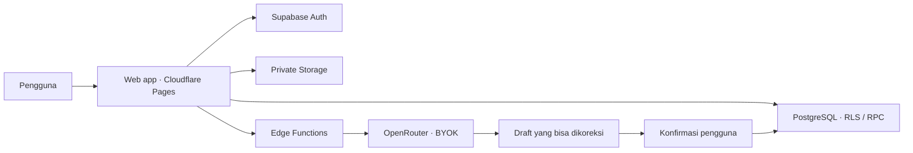

<div align="center">

# Masuk Saku

**Satu saku, semua catatan keuangan.**

[](https://github.com/huseinrosidstilllearn/masuk-saku/actions)
[](package.json)
[](LICENSE)
[](https://masuksaku.my.id)
[](docs/PRD.md)

</div>

Web app open source untuk mengelola keuangan pribadi dan keluarga: dompet, pemasukan, pengeluaran, anggaran, dan target tabungan. AI membantu membaca struk dan menyiapkan draft; kamu tetap memeriksa dan mengonfirmasi sebelum transaksi disimpan.

[Buka aplikasi](https://masuksaku.my.id) · [Development](https://masuk-saku-development.pages.dev) · [PRD](docs/PRD.md) · [Roadmap](docs/ROADMAP.md) · [Kontribusi](CONTRIBUTING.md)

## Status proyek

Versi paket **0.1.0**, menuju rilis V1. Aplikasi tersedia online, tetapi seluruh acceptance criteria V1 belum selesai. Status aktual ada di [ACCEPTANCE](docs/ACCEPTANCE.md), [Production](docs/PRODUCTION.md), dan [handoff](docs/AGENT-HANDOFF.md).

Fokus platform adalah **web app di browser**, responsif untuk desktop, tablet dan ponsel. Aplikasi native, installable PWA dan sinkronisasi ledger offline tidak termasuk cakupan saat ini.

## Fitur yang tersedia

| Area        | Kemampuan                                                                                                  |
| ----------- | ---------------------------------------------------------------------------------------------------------- |
| Dashboard   | Ringkasan keluarga/personal, saldo, arus kas, performa anggaran, target tabungan                           |
| Dompet      | Bank, tunai, e-wallet; dompet personal/shared keluarga dan saldo awal                                      |
| Transaksi   | Income, expense, transfer, biaya admin, status, split, kategori/tag, revisi, filter, pencarian, pagination |
| Pencatatan  | Manual, Quick Add, upload/foto struk dan preview AI yang dapat dikoreksi                                   |
| Perencanaan | Pengelolaan anggaran, target tabungan dan kontribusi virtual                                               |
| Laporan     | Perbandingan periode, arus kas, pengeluaran kategori, ekspor                                               |
| Akun        | Username/email dan password, verifikasi email, pemulihan password, inactivity lock                         |
| Keluarga    | Owner/Member, undangan terikat email, penonaktifan akses dengan riwayat dipertahankan                      |
| Profil      | Foto JPEG/PNG/WebP maksimal 2 MiB, nama lengkap/panggilan, username, telepon, tanggal lahir, kota, bio     |
| AI BYOK     | OpenRouter free-only, penggantian/pencabutan kunci per akun, encrypted server storage                      |
| Operasional | RLS, private Storage, maintenance, backup database terenkripsi ke Google Drive/GitHub artifact             |

Google login direncanakan, tetapi provider pada deployment saat ini belum aktif. Lifecycle dompet, recurring runner, penutupan rollover otomatis, import/restore lengkap dan sebagian pilot hosted masih dilacak di roadmap. Backup database sudah berhasil dijalankan; simulasi restore serta backup isi file Storage tetap diperlukan.

## Prinsip produk

- **AI-assisted, human-confirmed:** AI membuat draft; pengguna mengonfirmasi sebelum saldo berubah.
- **IDR V1:** integer rupiah, waktu WIB dan format 24 jam.
- **Identitas terpisah:** wallet_owner, transaction_actor, transaction_scope dan immutable created_by tidak disamakan.
- **Profil privat:** hanya nama panggilan dibagikan ke keluarga; foto dan informasi pribadi hanya untuk pemilik akun.
- **Sampah transaksi 30 hari:** Creator/Owner dapat trash; pemulihan dibatasi Owner.
- **Retensi struk:** default 24 jam setelah konfirmasi, dapat diatur immediate/7 hari/keep.
- **BYOK:** kunci AI dienkripsi di server, tidak disimpan di localStorage. Endpoint OpenRouter otomatis; custom endpoint belum tersedia.

## Teknologi dan arsitektur



| Lapisan       | Teknologi                                          |
| ------------- | -------------------------------------------------- |
| Frontend      | React, TypeScript, Vite, CSS, Lucide SVG, DM Sans  |
| Hosting       | Cloudflare Pages                                   |
| Auth/database | Supabase Auth, PostgreSQL, RLS, authorized RPC     |
| API           | Supabase Edge Functions, Deno                      |
| File          | Supabase private Storage; struk/avatar terpisah    |
| AI            | OpenRouter BYOK free-only, tanpa fallback berbayar |
| Email         | Supabase Auth melalui Resend SMTP                  |
| Backup        | GitHub Actions, pg_dump, age, rclone/Google Drive  |
| Verifikasi    | Vitest, PGlite, Playwright, Deno tests             |

Browser memakai publishable key dan sesi pengguna. Financial writes melalui RPC yang memeriksa izin dan keanggotaan. Edge memvalidasi sesi, mengakses server credentials dan memanggil AI provider. Service-role key dan encryption key tidak dikirim ke frontend. Baca [arsitektur](docs/ARCHITECTURE.md) dan [technical specification](docs/TECHNICAL-SPEC.md).

## Jalankan lokal

Butuh Node.js **>=22.12**, npm dan browser modern. Docker hanya diperlukan untuk stack Supabase lokal.

```sh
git clone https://github.com/huseinrosidstilllearn/masuk-saku.git
cd masuk-saku
npm ci
npm run dev:demo
```

Buka `http://127.0.0.1:5173`. Demo memakai contoh generik dalam memori; refresh mengembalikan data awal. Demo tidak menulis ke akun/database.

Untuk backend sendiri, salin `.env.example` ke `.env.development.local`:

```dotenv
VITE_SUPABASE_URL=https://YOUR_PROJECT.supabase.co
VITE_SUPABASE_ANON_KEY=YOUR_PUBLIC_PUBLISHABLE_KEY
```

Isi nilai project sendiri, lalu `npm run dev`. Jangan menaruh service-role key, API key AI, password database atau encryption key di variabel `VITE_*`.

## Build dan self-host

| Perintah                  | Hasil                     |
| ------------------------- | ------------------------- |
| npm run dev               | Development frontend      |
| npm run dev:demo          | Demo tanpa backend        |
| npm run build             | Production build ke dist/ |
| npm run build:development | Development build         |
| npm run build:demo        | Demo build                |
| npm run preview           | Preview build lokal       |

Gunakan `.env.production.local` untuk Production terpisah. Konfigurasi browser tidak otomatis memasang backend.

1. Buat Supabase project sendiri, pasang migrasi berurutan, deploy Edge Functions.
2. Atur Auth Site URL/redirect, SMTP dan Edge allowed origins sesuai domain sendiri.
3. Pasang server secrets dari `supabase/functions/.env.example`, simpan recovery keys secara aman.
4. Deploy `dist/` ke Cloudflare Pages; pertahankan security headers dan SPA fallback.
5. Konfigurasikan maintenance/backup, lalu uji akun, izin dan restore di environment terpisah.

Panduan: [deployment](docs/DEPLOYMENT.md), [production](docs/PRODUCTION.md), [operasional](docs/OPERATIONS.md), [Drive backup](docs/GOOGLE-DRIVE-BACKUP.md), [email](docs/AUTH-EMAILS.md). Script yang memuat project ref resmi harus disesuaikan untuk deployment sendiri; jangan menjalankannya terhadap layanan resmi proyek.

## Struktur repository

```text
src/                   Frontend, komponen, domain keuangan, client API
public/                Favicon, security headers, SVG, lisensi aset
supabase/migrations/   Schema, RLS, RPC, migrasi berurutan
supabase/functions/    Edge Functions dan shared server code
tests/                 SQL/domain, browser demo/configured-mode
scripts/               Deployment, backup, source guard
.github/workflows/     CI dan backup mingguan
docs/                  PRD, desain, arsitektur, panduan operasional
```

work/, environment lokal, NOTES.md, struk, backup dan konfigurasi privat tidak dipublikasikan. Environment examples hanya berisi template.

## Pengujian

```sh
npm run check
npm run test:e2e -- --workers=2
npm run test:auth -- --workers=2
npm run format:check
node --test tests/backup-drive.test.mjs
deno test --allow-env supabase/functions/_shared/
```

Playwright membutuhkan browser; jalankan `npx playwright install chromium` bila diperlukan. Configured-mode memakai backend fixture, bukan akun Production. SQL tests memakai PGlite dengan scaffolding Auth/Storage. Tes otomatis tidak menggantikan pilot multiakun, kamera fisik, AI provider nyata, retensi Storage dan restore backup.

## Dokumentasi

- [Identitas proyek](docs/PROJECT-IDENTITY.md): positioning, deskripsi dan suara produk.
- [PRD](docs/PRD.md), [acceptance](docs/ACCEPTANCE.md), [roadmap](docs/ROADMAP.md).
- [Design system](docs/DESIGN-SYSTEM.md), [referensi UI](docs/UI-REFERENCES.md), [motion](docs/MOTION.md).
- [Profil](docs/PROFILE.md), [username](docs/USERNAME-AUTH.md), [sesi](docs/SESSION-AUTH.md).
- [Keamanan](SECURITY.md), [kontribusi](CONTRIBUTING.md), [handoff agent](docs/AGENT-HANDOFF.md).

## Kontribusi dan lisensi

Laporkan bug/usulan melalui [GitHub Issues](https://github.com/huseinrosidstilllearn/masuk-saku/issues), dengan langkah reproduksi dan contoh generik. Jangan sertakan token atau data keuangan. Laporan kerentanan mengikuti [SECURITY.md](SECURITY.md).

Kode menggunakan [MIT License](LICENSE). Lisensi/atribusi aset dan recipe pihak ketiga ada di public/licenses/ dan dokumentasi desain/motion. Repository publik tidak memuat data keuangan pengguna.
