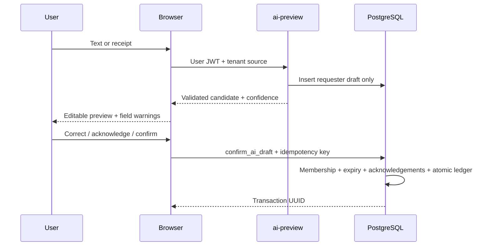

# API and Edge-function flows

Every browser request uses public project key plus user JWT; user identity and role come from Supabase Auth and membership table. User Edge handlers explicitly call getUser and check household membership; verify_jwt=false is configured to support signing key deployments consistently without treating decoded JWT claims as verification.

## RPC contracts

| RPC                 | Input                                                     | Result / guard                                                                                |
| ------------------- | --------------------------------------------------------- | --------------------------------------------------------------------------------------------- |
| create_household    | p_name, p_display_name                                    | UUID; authenticated; household + Owner + default categories atomic                            |
| create_transaction  | p_input JSON, p_request_key UUID                          | UUID; member; immutable creator; active tenant wallets; integer money; atomic fee/splits/tags |
| trash_transaction   | p_id UUID                                                 | void; creator or Owner; parent only; parent and fee into 30-day trash                         |
| restore_transaction | p_id UUID                                                 | void; Owner; before 30-day expiry; parent and fee restored                                    |
| confirm_ai_draft    | p_draft_id, p_input, p_acknowledged text[], p_request_key | UUID; requester/member; draft unexpired; critical low fields acknowledged; idempotent commit  |

p_input requires household_id, type, amount, wallet_id, occurred_at. Actor defaults to authenticated user. Scope defaults family; personal requires scope_member_id. destination_wallet_id only transfer; fee_amount nonnegative transfer-only. category_id optional; splits [{category_id,amount}], tag_ids [UUID]. source only manual/quick_add at public creation boundary. AI confirm sets source ai after successful commit. Status defaults completed.

## Edge contracts

**username-login** adalah endpoint public sebelum sesi, dengan password authentication dan quota, bukan household JWT. POST {username,password}, sukses {access_token,refresh_token}; email resolver hanya service-role. RPC own-user get_my_username()/set_my_username(p_username). Lihat [kontrak lengkap dan batas verifikasi](USERNAME-AUTH.md).

All endpoints POST; OPTIONS CORS only configured origins. JSON errors {error}; 400 invalid input, 401 session, 403 tenant/origin, 409 configuration/draft conflict, 413 too large, 422 unsupported extraction media, 429 quota, 502 provider failure/output invalid, 503 missing server configuration, 504 timeout. RPC database errors are sanitized at privileged Edge boundaries; UI displays ordinary user-authorized DB validation messages.

**ai-credentials:** {household_id, api_key, provider: 'openrouter', model: 'openrouter/free' (defaults; only these literals accepted)}. Encrypt AES-GCM with 12-byte nonce, 32-byte server key and household:user:v1 additional data. Stores one credential per member per household. Returns saved/provider/model, never key/ciphertext. Users cannot borrow another member's key, including Owner.

**attachment-upload:** multipart household_id + file; max 10MiB, verified PNG/JPEG/WebP/PDF signature; random private object name. Returns attachment_id; unconfirmed files expire 24h. Text/image AI consumes attachment_id. PDF is securely stored but OCR for PDF needs a later provider adapter; it currently returns explicit 422.

**ai-preview:** {household_id,text?,attachment_id?}. Own key required. At least one capture source. JWT + tenant check → 30 previews/user/hour → wallet/category context → fixed OpenRouter endpoint/free router → timeout 25s → strict Zod schema → validate returned IDs against context → requester draft. Missing critical values force null confidence. Confidence numbers come from model and are not calibrated. Draft expires 24h. Return {draft_id,candidate,confidence}; no ledger write occurs. Attachment must be own, unexpired, unconfirmed and unused.

**ai-confirm:** {draft_id,input,acknowledged,request_key}. Verified user + household, caller-JWT confirm_ai_draft RPC, then immediate retention deletes objects synchronously after commit. Returns transaction_id and cleanup_pending; failures retry via maintenance without reverting valid financial commit.

**maintenance:** Authorization Bearer MAINTENANCE_SECRET, no browser UI. Constant-time hash compare. Deletes up to 100 expired files/run; marks metadata only after deletion succeeds; then purges parent transactions older than 30d, cascades fees/splits/tags and expires drafts. Run every 15 minutes or more often if volume exceeds 100 per run. Physical retention timing is best-effort with scheduler latency; access policies hide expired receipts immediately. Normal ai-confirm path performs immediate deletion after commit; direct RPC callers and failed Storage deletes use the next cleanup run.

## Confirmation flow

Stable request_key is generated when preview opens and reused on retry. Confirmed draft returns existing UUID only for same key/payload. Client manual creation cannot claim source ai. Refresh reads actual ledger after writes; no optimistic balance mutation on provider output.

## Planning UI — 27 September 2026

Browser-side planning writes use the existing RLS-protected tables, not privileged Edge functions or ledger RPCs. [Supabase insert](https://supabase.com/docs/reference/javascript/insert) and [update](https://supabase.com/docs/reference/javascript/update) documentation were consulted for mutation/select behavior.

- budgets INSERT/PATCH: same-tenant Member/Owner; fields id,name,category_id,wallet_id,amount,start_date,end_date,warning_thresholds,rollover,rollover_amount. Form creates reset periods and preserves existing rollover metadata; automatic period closure/carry is not implemented. Composite FKs prevent foreign category/wallet references. Limits/dates/thresholds checked in UI/domain and existing SQL constraints.
- savings_goals INSERT/PATCH: same-tenant Member/Owner; id,title,target_amount,deadline,notes,status. saved is derived from contributions and never sent as a writable goal field. Archive hides the goal from dashboard/default goal list, keeps history, and can be reversed in the editor via Include archives.
- goal_contributions INSERT: id,household_id,goal_id,amount,created_by,contributed_at. created_by must equal auth.uid(); goal/member composite FKs enforce tenant. Date input records noon WIB on selected day. Contributions are virtual; no ledger rows/wallet changes.
- goal_contributions DELETE: confirmed UI correction, creator or Owner only. This removes virtual progress permanently; the30-day transaction trash policy applies to ledger transactions, not these planning notes. Contribution UPDATE is not granted.

New inserts keep a UUID for the lifetime of the form. Duplicate key triggers authorized read + exact payload comparison (canonical numeric/date handling); identical retry succeeds, changed payload rejects. Edits compare original writable fields atomically in PATCH filters, then select updated ID. No matching row triggers an authorized reread: exact desired state is an already-applied retry; otherwise a conflict message asks for reload. This is compare-before-write, not a general row-version subsystem. Concurrent contribution inserts do not overwrite derived goal progress. Busy forms prevent repeated submits and remain open on write errors. Snapshot refresh failure remains an error, not a false success toast.

Schema/RLS were already deployed in Development; no new migration or remote deployment was required. Authenticated hosted planning CRUD still needs the household pilot; local browser tests use the memory adapter and SQL role tests exercise the installed schema under PGlite.

## Transaction revision

Browser calls revise_transaction(p_id uuid,p_expected_version integer,p_input jsonb,p_request_key uuid). Input is a complete replacement of writable TransactionInput fields with household_id. Require stable UUID for retries. Parent row FOR UPDATE and version comparison prevent lost updates; stale revisions raise version conflict and the form preserves entries. User closes/reloads before reopening latest data; no silent overwrite or automatic merge. Reusing a request key with identical transaction/version/input/requester returns the original resulting version without another write; different payload is rejected. Successful write returns new integer version.

Only the transaction creator or household Owner may revise/read history; actor-only status gives no permission. Trashed or linked-fee rows cannot be edited directly. Source,creator,creation request identity and tags are preserved. Input with created_by/source/tag_ids is rejected. Splits replace atomically and must total the whole-rupiah principal. Fee is one linked expense: update existing identity/creator, add if needed, delete when zero or nontransfer; scope/status/date/wallet follow parent. Failure anywhere rolls back parent,fees,splits,audit/history. Balance remains derived,never directly patched. Human must click Konfirmasi & simpan.

transaction_revisions is RLS SELECT-only for creator/Owner, no authenticated DML. Stores immutable before/after parent,fees,splits,tags snapshots and actor/date/request/version. Parent cascade deletes full revisions on permanent purge after trash30days; activity_log keeps identifier-only audit. UI loads latest100 revisions with field differences and current member/wallet/category labels. JSON export now includes transaction version but does not claim a full revision-history backup/restore implementation. Revision snapshots include tag rows; UI preserves tags without editing them.

Existing installations apply migration202609270004 with CLI db push; do not rerun bootstrap. Production needs the same migration before enabling this feature there.

## Receipt capture web flow

Upload struk opens ReceiptCapture. Client verifies JPEG/PNG/WebP signatures and1..10485760bytes; backend independently validates. PDF selection is rejected by this UI because the current AI adapter does not extract PDF. Selecting a file only creates a local Blob URL; neither wallet nor server is touched. Choosing Baca dengan AI sends multipart FormData household_id/file to attachment-upload with60s timeout. SDK owns the multipart boundary; no manual Content-Type. Returned attachment_id is kept in component memory and reused for preview retry while available.

ai-preview receives household_id,optional trimmed text,attachment_id with45s client timeout. Existing server checks owner/tenant/expiry,private storage,BYOK/quota and image extraction; returns draft_id,candidate,confidence. Frontend Zod rejects malformed draft UUID/amount/date/confidence and converts missing fields to absent/empty input,forcing critical null confidence warnings. No capture module invokes ai-confirm or ledger. App opens TransactionForm with a stable request UUID and local File preview. Final human confirmation uses existing ai-confirm flow; retentions come from household policy. Unknown wallet remains unselected; low critical scores require acknowledgment.

Provider/BYOK/quota/session errors become bounded Indonesian messages without dumping raw responses. Uploaded ID survives provider failure within the open modal; changing/removing file resets it. Ambiguous network failures can leave an orphan upload/draft; selecting again may create a new upload,abandoned cleanup policy24h applies. Refresh/closing discards local state; draft resume is not implemented. Catat manual tanpa lampiran deliberately uses manual create without attaching the file; no silent attachment association. Local URLs are revoked on modal close; no file/provider key enters browser persistent storage. Demo permits local file validation/preview and manual fallback,AI button disabled. No mock OCR result is presented as real AI.

Backend/functions/schema unchanged in this slice. Maintenance physical deletion still requires the external scheduler; policy expiry is not evidence a hosted cleanup job is active. Hosted upload/provider/confirm/storage acceptance remains a release check with a real session and disposable BYOK.

## OpenRouter free-only —27September2026

User menyetujui pakai OpenRouter saja untuk AI gratis. Active endpoint fixed https://openrouter.ai/api/v1/chat/completions, model literal openrouter/free; no arbitrary URL/model/fallback model list. Request JSON mode,require_parameters=true,max_price prompt/completion/request/image=0,data_collection=deny. Provider availability/privacy/JSON/image constraints may leave no matching free model; fail/manual instead of switching paid. Free routing pool is dynamic; no specific vision model guarantee. Existing output IDR/schema/context/confidence validation and human-confirm boundary unchanged. Provider429 mapped as quota failure. BYOK encrypted AES-GCM/AAD unchanged; encryption key not regenerated.

Migration202609270005_openrouter_free.sql expands provider constraint for legacy+new,default OpenRouter/free,server-only store RPC rejects all other models and marks new saved credential OpenRouter. read RPC adds provider to returned fields with EXECUTE still service-only. Old OpenAI ciphertext/model/provider preserved,inactive at Edge until user saves new OpenRouter key; never silently reroute old key. bootstrap includes all5 migrations for NEW projects. API/UI labels updated including receipt destination; client save sends explicit provider/model. No actual user/provider credentials stored by agent.

Files: new migration + functions/_shared/openrouter.ts/openrouter_test.ts,ai-credentials,ai-preview,repository,App,ReceiptCapture,SQL/browser tests,docs. Fresh npm run check passed57 unit/database tests+TypeScript+Production build;16 browser tests passed;Deno check all5 functions passed;6 Deno tests passed (79 total executed). NewSQL test validates legacy preservation,service-only read/free-only store;3 newDeno tests paid/endpoint rejection,zero-price+JSON+image/text invariants,legacy guard;browser verifies OpenRouter UI/disclosure. Bundle>500kB advisory unchanged. No real OpenRouter call/upload/financial mutation/account made; hosted authenticated text/image/confirm still requires user's session/key.

Development ref verified kxezrgvnpoaqzcseymts. db push dry-run selected only202609270005; applied,5 Local/Remote matched. Deploy order DB→ai-preview→ai-credentials; both ACTIVEv2,othersv1. Anonymous POST valid body to both updatedfunctions401; no provider call. Production/Cloudflare unchanged. Storage still Supabase; R2 suggestion documented only,do not claim migrated. Operational cleanup/backup/Google/PDF/full V1 pending.

Next: user adds OpenRouter key through Pengaturan (never request in chat); pilot text+receipt+confirmation with real session. Local backlog category/tag management/invites/reports remains. Rate limits checked official docs: basic free50requests/day,20/minute; local previewquota30/user/hour is separate,doesn't mirror provider remaining count. Caps are rejection filters,not promise unlimited or zero-cost infrastructure. Provider data_collection deny doesn't certify OpenRouter's own account logging; hosted privacy settings still user-managed.

Sources checked: [Free router](https://openrouter.ai/docs/guides/routing/routers/free-router),[routing/price/privacy parameters](https://openrouter.ai/docs/guides/routing/provider-selection),[rate limits](https://openrouter.zendesk.com/hc/en-us/articles/39501163636379-OpenRouter-Rate-Limits-What-You-Need-to-Know). Latest user decision supersedes older OpenAI-only notes,not archived source conversation. No new design-library source copied.

## Household invitations

Empat RPC undangan create/list/revoke/accept tersedia; management Owner, acceptance email-bound verified Member. Tidak mengirim email otomatis. Kontrak, guards, token lifecycle dan pilot di [HOUSEHOLD-INVITATIONS.md](HOUSEHOLD-INVITATIONS.md).
