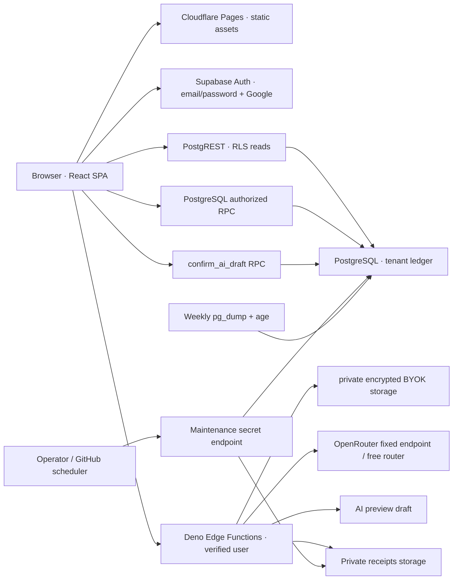

# Architecture

## Components

Username password login menambah adapter public Edge sebelum sesi: validasi/quota, service-only resolve email terkini, lalu Supabase Auth password verification dan token untuk Auth setSession browser. Private handles unik dan own-user RPC terpisah dari household display_name. Lihat [username auth](USERNAME-AUTH.md); jalur AI Edge di diagram tetap memerlukan verified-user.

Frontend has no AI credentials or privileged database keys. Ledger balance computation exists in pure TypeScript for demo/UI and an invoker view in PostgreSQL; tests reconcile semantics. Frontend reads through user's JWT/RLS and creates/trashes/restores through RPC. Money is whole IDR. Fees are child expense rows; only parent shown as a logical transfer.

## Ownership and permission

wallet_owner describes funds ownership; transaction_actor describes who did it; transaction_scope plus scope_member_id describe beneficiary/context; created_by is immutable recording identity. Dashboard personal mode filters wallet owner. Shared wallets appear family-only. Visibility is household-wide V1; personal wallet does not promise privacy from a spouse. Granular wallet ACL is an extension, not silently invented. Member removal requires historical identity preservation; current FK restricts deletion while references exist. Invitation/removal RPC design in roadmap will add active membership instead of deleting history.

## Data and AI flows

Manual/Quick Add → editable preview → click confirm → create_transaction RPC → atomic parent/splits/tags/fee + audit. request_key bound to creator and exact payload, retry returns same transaction. No mutable balance columns.

AI key form → verified Edge → AES-GCM with household/user-associated data → private credentials. Capture → verified Edge → quota → tenant wallet/category context → provider → strict output schema → requester-only draft. No finance write in AI extraction handler. Human confirmation uses separately authorized RPC and low-confidence acknowledgements. Provider failure leaves manual flow available.

Receipt upload → verified bytes/type → randomized private object path → metadata expiry after 24h if abandoned. After confirmation expiry recalculated from confirmed_at per retention setting; maintenance deletes files and marks metadata after Storage succeeds. Expired files are unavailable by RLS even before physical cleanup. Trash purged after 30d while audit identifiers survive.

## Decisions and extension seams

- SPA suits Pages static hosting and minimizes platform-specific backend behavior.
- Supabase self-host replaces hosted URL/key without rewriting financial rules. Standalone PostgreSQL alone does not reproduce Auth/PostgREST/Storage/Edge.
- Private schema for secrets; public server-only RPC wrappers used because private schema is not exposed by PostgREST.
- security definer RPC functions explicitly validate membership; blank search_path, full-qualified names; no PUBLIC execute on sensitive functions.
- Browser web app only. No service worker caching financial data; installable PWA and offline synchronization are outside the current scope.
- No Realtime subscription in starter. Refresh after writes; live multi-device synchronization is a roadmap item.
- Server adapter fixed to OpenRouter openrouter/free. Zero-price caps apply to prompt/completion/request/image; JSON-support required, provider data collection denied. No paid model fallback or arbitrary external endpoint from user input.

Operational backup includes public/auth/private/storage metadata; blobs are excluded by default consistent with retention. Internal Auth schema restore requires matching Supabase versions and staging rehearsal. [Operations](OPERATIONS.md).
