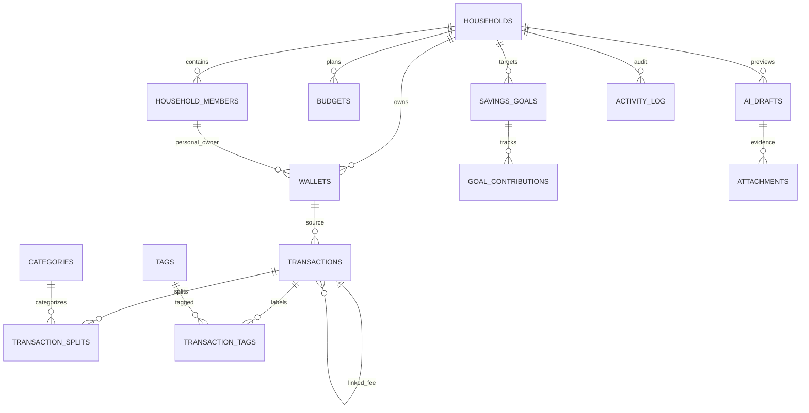

# Database and RLS

## Current V1 additions — 28 September 2026

Development has migrations 1–17. Append migrations 12–17 add wallet versions/audit details, recurring occurrences and approval/runner RPCs, immutable budget period closure and unique successors, atomic snapshot import receipts, requester draft discard and Realtime publication. Production remains at migrations 1–11 until separately promoted. Never rewrite an applied migration. See [API contracts](API-FLOWS.md), [feature behavior](V1-FEATURES.md) and [deployment](DEPLOYMENT.md) before changing these tables.

Apply migrations in timestamp order to a **new Supabase project**. PostgreSQL 17 is configured; no destructive reset is needed for an existing project. Embedded tests scaffold Auth/Storage interfaces and execute all SQL on a real PostgreSQL engine.

## Entities



Additional tables: recurring_templates, member_preferences; private.ai_credentials and private.ai_rate_limits. All user-facing tables have RLS. FKs pairing household_id with referenced id prevent cross-household wallet/category/actor/tag/split/goal/template injection even where the same user joins both households.

## Migration responsibilities

| File                          | Behavior                                                                                           |
| ----------------------------- | -------------------------------------------------------------------------------------------------- |
| 202609260001_schema.sql       | Tables, tenant FK, numeric/type constraints, indexes, invoker balance view                         |
| 202609260002_security_rpc.sql | RLS/grants, category depth, audit triggers, household/ledger/trash/AI RPCs, privileged maintenance |
| 202609260003_storage.sql      | Private receipts bucket, allowed MIME/10MiB, metadata-authorized read                              |

## Permissions

| Resource                      | Member                                         | Owner                             | Service role          |
| ----------------------------- | ---------------------------------------------- | --------------------------------- | --------------------- |
| Household/member roster       | Read                                           | Read + household settings columns | Provision/admin       |
| Wallets                       | Read                                           | Insert/update; archive via active | Operations            |
| Transactions/splits/tags      | Read; writes only RPC                          | Same                              | Operations            |
| Trash transaction             | Creator only                                   | Any household parent              | Purge after 30 days   |
| Restore transaction           | Denied                                         | Within 30 days                    | Operations            |
| Categories/tags/budgets/goals | Tenant CRUD with FK checks                     | Same                              | Operations            |
| Contributions                 | Insert as self; delete self                    | Delete any                        | Operations            |
| AI drafts                     | Own drafts read                                | Own drafts read                   | Insert/maintenance    |
| Attachments                   | Own unconfirmed / confirmed household metadata | Same                              | Upload/delete objects |
| Activity log                  | Denied                                         | Read                              | Trigger inserts       |
| BYOK ciphertext               | Denied                                         | Denied                            | Server-only RPC       |

No grant allows creator spoofing on ledger; auth.uid() supplies created_by. No authenticated direct DML to transactions, splits, tags, audit, attachments or drafts. Private RPC EXECUTE is revoked from PUBLIC/anon/authenticated. Membership helper avoids recursive roster RLS. Service role bypasses RLS, so Edge membership validation is mandatory before every privileged read/write.

## Ledger examples

```sql
-- Caller supplies their session JWT via Supabase client, never service role.
select public.create_transaction(
 '{"household_id":"HOUSEHOLD_UUID","type":"transfer","amount":100000,
 "fee_amount":2500,"wallet_id":"SOURCE_UUID","destination_wallet_id":"DEST_UUID",
 "transaction_actor":"MEMBER_UUID","transaction_scope":"family",
 "status":"completed","occurred_at":"2026-09-26T12:00:00+07:00"}'::jsonb,
 'REQUEST_UUID'::uuid
);
select public.trash_transaction('TRANSACTION_UUID'::uuid);
select public.restore_transaction('TRANSACTION_UUID'::uuid);
```

Source balance reduces by 102500, destination increases by 100000. Household expense = 2500, principal transfer excluded from income/expense. Fee follows parent status/trash/restore and deletion cascades. Split input is validated before atomic insert; sum must equal amount. Category one-level guard and tenant FKs apply to direct metadata CRUD. Owner opening-balance edits are audited.

## Historical foundation limitations — 26 September 2026

The original foundation had no recurring runner/revision RPC and rejected the 10k query cap. Current migrations and the paginated loader replace those limitations; inactive membership and verified invitations preserve history. Generated Supabase Database types remain a developer improvement. Full restore still uses controlled tooling, not arbitrary JSON writes to privileged tables.

## Transaction revisions — migration202609270004

Adds transaction_revisions, RLS creator/Owner read, a private snapshot helper and authenticated revise_transaction RPC. Full snapshots are tenant-bound via composite parent FK ON DELETE CASCADE. Same-request retry is checked before expected-version comparison; auth/membership are always checked first. No direct ledger/revision DML grants to authenticated. Parent lock serializes revision/trash/restore. Balance view requires no changes. Creator/source/request identity and tags remain immutable across revision. Database tests exercise permissions, stale-version rejection, exact retry, rollback and permanent purge.

Migration202609270007 adds private.household_invitations and four guarded RPCs. Invitation codes are stored only as SHA256; auth.users authoritative verified email and owner membership checks gate acceptance/management. Member insert + code consumption + minimal audit are atomic. See [contracts](HOUSEHOLD-INVITATIONS.md).
